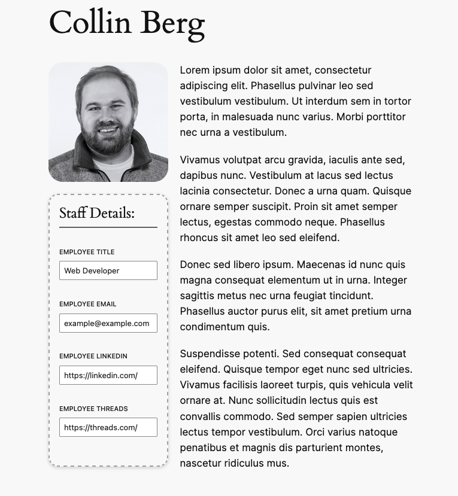

# Staff Directory Guide

## Description

An small plugin that creates a Staff custom post type, allowing you to create and group people in your organization, and output them using a custom block.

## Getting Started

The Staff Directory Guide plugin allows creates a custom post type of staff. This post type comes equipped with 4 social profile link fields, picture, and biography area. The plugin comes equipped with default templates for staff profiles, but can be over-written in themes.

The plugin comes equiped with a [staff] shortcode that can be used to output a grid of every employee. A custom block to achieve this is currently in development.

## Installing

1. Sign in to WordPress.
2. In the left-hand menu, select Plugins > Add New.
3. Select Upload Plugin.
4. Select Choose File.
5. Locate and select the plugin .zip file on your local computer and then select Open.
6. Select Install Now.
   Optional: Select Activate Plugin if you want the plugin to be active after the installation. If not, you can always activate it later.

## Authors

[Collin Berg](https://hirecollin.com)

## License

This project is licensed under the GPLv2 License.

## Acknowledgments

- My faithful dog, Dante, who never leaves my side and is forever burrowing under overs.
